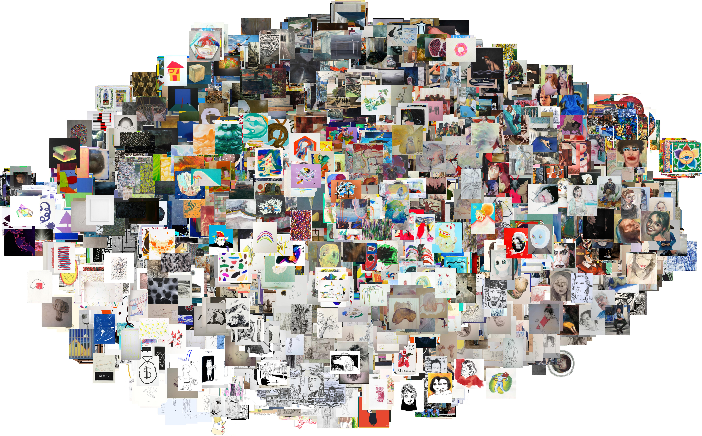
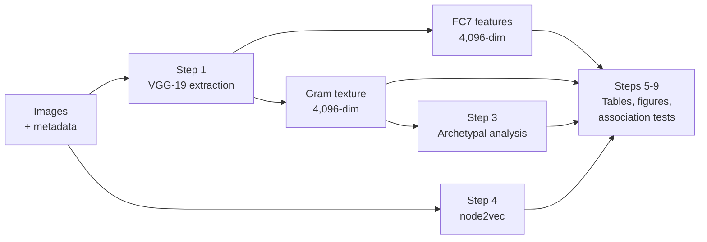

# contempart-eccv2020

A clean, end-to-end reproduction pipeline for the analysis in:

> Huckle, N., Garcia, N., & Nakashima, Y. (2020). *contempArt: A Multi-Modal Dataset of Contemporary Artworks and Socio-Demographic Data.* ECCV Workshop on Computer Vision for Fashion, Art and Design. [arXiv:2008.09558](https://arxiv.org/abs/2008.09558)



See also: [contempart](https://github.com/georgeblck/contempart) (dataset + metadata) and [contempart-clip](https://github.com/georgeblck/contempart-clip) (re-analysis with CLIP and Stable Diffusion embeddings).

## Goal

Provide a transparent, auditable pipeline that goes from raw images to every table and figure in the paper. No manual steps, no pre-computed artifacts required. A student or researcher should be able to clone this repo, point it at the images, and reproduce the full analysis.

## Pipeline



### Running it

```bash
uv sync

# Feature extraction (~5h CPU, <1h CUDA)
uv run python -m src.step1_extract_vgg

# Archetypal analysis (~5 min)
uv run python -m src.step3_archetype

# Social graph + node2vec (~1 min)
uv run python -m src.step4_network

# Analysis (each <1 min, except step8 ~30 min)
uv run python -m src.step5_variance
uv run python -m src.step6_correlations
uv run python -m src.step7_visualize
uv run python -m src.step8_cluster
uv run python -m src.step9_association
```

Step 1 supports checkpointing (resumes after interruption) and memory-mapped arrays (runs safely with limited RAM). Use `--limit 100` for a quick test run.

## What each step does

| Step | Script | Paper section | Output |
|------|--------|---------------|--------|
| 1 | `step1_extract_vgg.py` | p.7-8 | VGG-19 FC7 features + Gram texture descriptors |
| 3 | `step3_archetype.py` | p.8-9 | Archetypal analysis mixture weights |
| 4 | `step4_network.py` | p.12-13 | Social graph distance matrices via node2vec |
| 5 | `step5_variance.py` | Table 2 | Per-artist and global style variance (sigma_c) |
| 6 | `step6_correlations.py` | Table 3 | Spearman rho between style and social distances |
| 7 | `step7_visualize.py` | Figure 3 | t-SNE of artist centroids by school/gender/continent |
| 8 | `step8_cluster.py` | Figure 4 | k-means AMI and purity on WikiArt styles |
| 9 | `step9_association.py` | Section 6.2 | Cramer's V between VGG clusters and demographics |

## Data

Place the following in `data/` before running:

```
data/
  contempart_images/           <- 14,559 artwork images
  wikiart_images/              <- 20,000 WikiArt images
  artists.csv                  <- artist metadata (442 rows)
  images_manifest.csv          <- image-to-artist mapping (14,559 rows)
  edgelist.csv                 <- Instagram follower graph
  wikiart_metadata.csv         <- WikiArt sample metadata (20,000 rows)
```

Download the contempArt dataset from [Zenodo](https://doi.org/10.5281/zenodo.19365430). Pre-computed embeddings are also available on [Zenodo](https://doi.org/10.5281/zenodo.19367364) if you want to skip feature extraction.

## Reproduction notes

VGG FC7 results match the paper exactly (sigma_c = 0.283, max AMI = 0.190 vs paper's 0.191). Texture values are close, with small differences from SVD randomization. Archetype values differ more because this pipeline uses [py_pcha](https://github.com/elaa0505/py_pcha) (Python) instead of SPAMS (C++), and the two solvers find different local optima. The qualitative conclusions are the same across all three embedding types.

### Feature extraction details

VGG-19 features are extracted at 512x512 resolution (LANCZOS interpolation), matching the original pipeline. FC7 comes from the second fully connected layer pre-ReLU (preserving negative activations). Gram texture features concatenate spatial means and Gram matrix upper triangles from conv layers 2-5, normalized by channel count, then reduced to 4,096 dimensions via TruncatedSVD.

CUDA is used when available. MPS (Apple Silicon) is not supported due to a PyTorch limitation with adaptive pooling at non-standard input sizes.

## Citation

```bibtex
@inproceedings{huckle2020contempart,
  title={contempArt: A Multi-Modal Dataset of Contemporary Artworks
         and Socio-Demographic Data},
  author={Huckle, Nikolai and Garcia, Noa and Nakashima, Yuta},
  booktitle={European Conference on Computer Vision,
             Workshop on Computer Vision for Fashion, Art and Design},
  year={2020}
}
```
